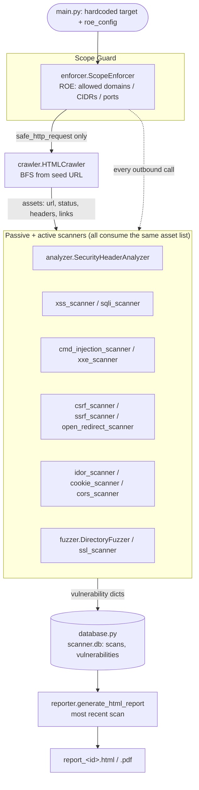

# SecuritScanner

[](https://github.com/James-Agall/SecuritScanner/actions/workflows/ci.yml)


A from-scratch Python web application security scanner: crawler, passive header
analysis, 14 active vulnerability scanners, SQLite persistence, and HTML/PDF
report generation — built without wrapping an existing tool (no ZAP/Burp
under the hood).

> **Authorized testing only.** This scanner sends live HTTP requests, injects
> payloads, and attempts authentication bypass. Every request is gated through
> a scope enforcer (`enforcer.py`) that blocks anything outside an explicit
> allowlist of domains/CIDRs/ports, but the tool is still only meant to be
> pointed at targets you own or are explicitly authorized to test — such as
> the bundled `local_target.py`, an intentionally vulnerable Flask app used
> as the default scan target in development.

## Why this exists

Most "scanner" side projects are thin wrappers around `requests` + a payload
list. This one is built around a single non-negotiable rule instead: **every
outbound HTTP call, from every scanner, must pass through one scope-checking
choke point.** That constraint shapes the whole architecture — see
[Architecture](#architecture) below — and is enforced by tests, not just
convention.

## Features

| Category | Modules |
|---|---|
| **Recon / passive** | BFS crawler, security header analysis (HSTS, CSP, X-Frame-Options, verbose `Server` headers) |
| **Injection** | Reflected XSS, error-based SQL injection, OS command injection, XXE |
| **Access control** | IDOR (authenticated), directory/file fuzzing (`.env`, `.git/config`, admin paths, ...) |
| **Request forgery** | CSRF (missing token detection), SSRF, open redirect |
| **Transport / session** | SSL/TLS certificate & config checks, cookie security flags (`Secure`, `HttpOnly`, `SameSite`) |
| **Misconfiguration** | CORS policy analysis |
| **Evasion** | WAF/bot-protection detection and stealth request pacing (`evasion.py`) |

Every scanner returns findings in one common shape (type, severity, URL,
vulnerable parameter, payload, description, remediation), persisted to
SQLite and rendered into a single HTML/PDF report per scan.

## Architecture



`main.py` wires this pipeline together as a single top-level script (target
URL and `roe_config` are hardcoded, not CLI flags) — see `CLAUDE.md` for the
full per-module breakdown and the conventions new scanners must follow.

## Quickstart

### Local (venv)

```bash
python -m venv venv
source venv/bin/activate        # Windows: venv\Scripts\activate
pip install -r requirements-dev.txt

# terminal 1 - the intentionally vulnerable target
python local_target.py          # https://localhost:5000

# terminal 2 - crawl + scan + report
python main.py
```

PDF report generation additionally requires the `wkhtmltopdf` system binary
on your `PATH` (https://wkhtmltopdf.org/); without it, the scanner still
produces the HTML report and logs a warning instead of the PDF.

### Docker

```bash
docker compose up --build --abort-on-container-exit
```

This runs `local_target.py` and `main.py` as two containers sharing one
network namespace (so the scanner's hardcoded `https://localhost:5000`
resolves correctly without touching source), gated by a healthcheck that
waits for the target to accept HTTPS connections before the scan starts.
Grab the results afterward:

```bash
docker cp $(docker compose ps -q scanner):/app/scanner.db .
```

The `Dockerfile` itself runs the full test suite as a build step — the image
will not build if a test fails.

## Testing & quality

```bash
pytest              # 175 tests, 93% branch coverage (pyproject.toml config)
ruff check .         # lint
mypy .               # static typing (application modules; tests/ excluded)
```

All three run in CI on every push/PR to `main` (`.github/workflows/ci.yml`),
alongside a Docker build that re-validates the test-gated image.

## Project structure

```
enforcer.py              ROE / SSRF guardrail — every request goes through safe_http_request()
crawler.py                BFS crawler, produces the shared "asset" list
analyzer.py                passive security-header analysis
xss_scanner.py, sqli_scanner.py, cmd_injection_scanner.py, xxe_scanner.py
csrf_scanner.py, ssrf_scanner.py, open_redirect_scanner.py
idor_scanner.py, cookie_scanner.py, cors_scanner.py
fuzzer.py, ssl_scanner.py  active vulnerability scanners
evasion.py                 WAF/bot-protection evasion helpers
database.py                 sqlite3 persistence (scans, vulnerabilities)
reporter.py                 HTML/PDF report generation
local_target.py            intentionally vulnerable Flask app used as the default scan target
main.py                     wires the pipeline together (hardcoded target + roe_config)
tests/                      175 tests incl. a live-server end-to-end integration test
```

## Known limitations

- `main.py` is a fixed pipeline script, not a CLI — the target URL and
  `roe_config` (allowed domains/ports, credentials, stealth mode) are edited
  directly in the file.
- `local_target.py` and `reporter.py` contain deliberately unsafe patterns
  (raw SQL interpolation, unescaped HTML templating) that exist specifically
  to give the scanners something to find — see `CLAUDE.md`.
