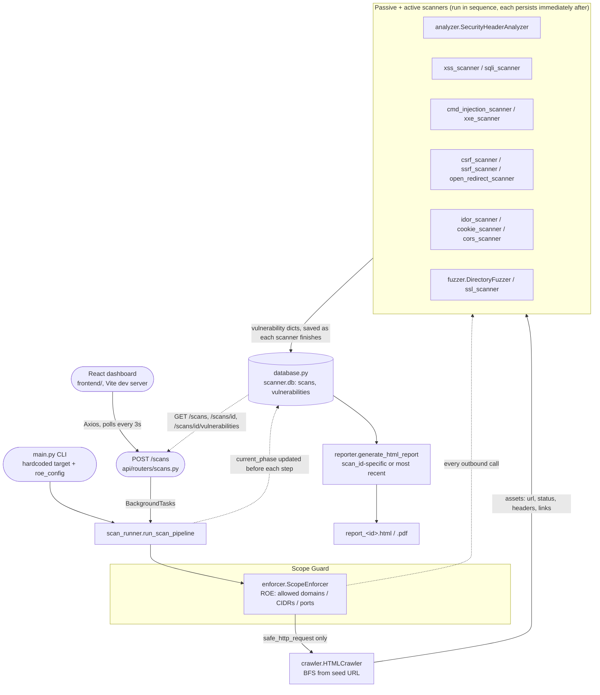

# SecuritScanner

[](https://github.com/James-Agall/SecuritScanner/actions/workflows/ci.yml)


A from-scratch Python web application security scanner: crawler, passive header
analysis, 14 active vulnerability scanners, SQLite persistence, and HTML/PDF
report generation — built without wrapping an existing tool (no ZAP/Burp
under the hood). A FastAPI backend and React dashboard sit on top of the same
scan pipeline the CLI uses, with live progress (which scanner is running,
findings found so far) while a scan is in flight.

> **Authorized testing only.** This scanner sends live HTTP requests, injects
> payloads, and attempts authentication bypass. Every request is gated through
> a scope enforcer (`enforcer.py`) that blocks anything outside an explicit
> allowlist of domains/CIDRs/ports, but the tool is still only meant to be
> pointed at targets you own or are explicitly authorized to test — such as
> the bundled `local_target.py`, an intentionally vulnerable Flask app used
> as the default scan target in development.

## Why this exists

Most "scanner" side projects are thin wrappers around `requests` + a payload
list. This one is built around a single non-negotiable rule instead: **every
outbound HTTP call, from every scanner, must pass through one scope-checking
choke point.** That constraint shapes the whole architecture — see
[Architecture](#architecture) below — and is enforced by tests, not just
convention.

## Features

| Category | Modules |
|---|---|
| **Recon / passive** | BFS crawler, security header analysis (HSTS, CSP, X-Frame-Options, verbose `Server` headers) |
| **Injection** | Reflected XSS, error-based SQL injection, OS command injection, XXE |
| **Access control** | IDOR (authenticated), directory/file fuzzing (`.env`, `.git/config`, admin paths, ...) |
| **Request forgery** | CSRF (missing token detection), SSRF, open redirect |
| **Transport / session** | SSL/TLS certificate & config checks, cookie security flags (`Secure`, `HttpOnly`, `SameSite`) |
| **Misconfiguration** | CORS policy analysis |
| **Evasion** | WAF/bot-protection detection and stealth request pacing (`evasion.py`) |

Every scanner returns findings in one common shape (type, severity, URL,
vulnerable parameter, payload, description, remediation), persisted to
SQLite as soon as each scanner finishes — not batched at the end — so a
running scan's findings count and current phase are both genuinely live, not
just cosmetic. Findings are rendered into a single HTML/PDF report per scan.

## Architecture



`scan_runner.run_scan_pipeline()` is the single implementation of the pipeline; both `main.py` (CLI, target
URL and `roe_config` hardcoded, not CLI flags) and the FastAPI app (`api/`, see [Web API](#web-api) below)
call it — so the CLI and the web API can never drift apart. See `CLAUDE.md` for the full per-module
breakdown and the conventions new scanners must follow.

## Quickstart

### Docker — one command, everything running

```bash
docker compose up --build
```

This is the easiest way to run the whole thing: it builds and starts four services on one Docker network —
`target` (the vulnerable Flask app), `api` (FastAPI backend), `frontend` (the React dashboard), and `scanner`
(a one-shot CLI run against `target` that exits once it's done). The Python image runs the full test suite
as a build step, so it won't build if a test fails.

Once it's up:

- **Dashboard**: `http://localhost:5173` — start a scan, watch it run (current phase + live findings count
  update automatically), view/download the report when it's done.
- **API docs**: `http://localhost:8000/docs`

To scan `target` from the dashboard or the API, use `https://target:5000/` as the target URL (Docker DNS
name) with "Allow local/private-IP targets" checked — `target` resolves to a private Docker-internal IP, so
`allow_local_testing: true` is required (see [Web API](#web-api) below).

If you change Python or frontend source and rebuild, run `docker compose down -v` first — the named volumes
that back `scanner`/`api`/`target`'s writable `/app` are seeded once from the image and won't pick up a
rebuilt image's code otherwise (see [Known limitations](#known-limitations)).

### Native (venv + npm) — for editing backend or frontend code directly

```bash
python -m venv venv
source venv/bin/activate        # Windows: venv\Scripts\activate
pip install -r requirements-dev.txt

# terminal 1 - the intentionally vulnerable target
python local_target.py          # https://localhost:5000

# terminal 2 - the API
uvicorn api.app:app --reload    # http://localhost:8000

# terminal 3 - the dashboard
cd frontend && npm install && npm run dev   # http://localhost:5173
```

Or skip the API/dashboard entirely and just run the CLI pipeline directly against `local_target.py`:

```bash
python main.py
```

PDF report generation additionally requires the `wkhtmltopdf` system binary
on your `PATH` (https://wkhtmltopdf.org/); without it, the scanner still
produces the HTML report and logs a warning instead of the PDF.

## Web API

A REST API (`api/app.py`, FastAPI) exposes the same pipeline over HTTP, backing the React dashboard in
`frontend/`. `python main.py` keeps working exactly as before — the API is an additional interface, not a
replacement.

```bash
uvicorn api.app:app --reload
```

Interactive OpenAPI docs: `http://localhost:8000/docs`. `POST /scans` runs the full crawl + 14-scanner
pipeline as a background task and returns immediately (`status=pending`); poll `GET /scans/{id}` until
`status` reaches `completed`/`failed`. While a scan runs, `status` is `"running"` and `current_phase` names
whichever scanner is currently executing (`"xss_scan"`, `"ssrf_scan"`, etc.) — and `vulnerability_count`
already reflects findings saved so far, since each scanner persists its results immediately rather than
waiting until the whole pipeline finishes.

| Method | Path | Description |
|---|---|---|
| `POST` | `/scans` | Start a scan (`target_url` required; scope/creds optional, see `/docs`) |
| `GET` | `/scans` | List all scans, most recent first, with live `current_phase` + `vulnerability_count` |
| `GET` | `/scans/{id}` | Get one scan |
| `DELETE` | `/scans/{id}` | Delete a scan and its findings |
| `GET` | `/scans/{id}/vulnerabilities` | List findings for a scan (works while running too, not just once completed) |
| `GET` | `/scans/{id}/report?format=html\|pdf` | Download the report (404 if scan not found, 409 if still running) |

```bash
curl -X POST http://localhost:8000/scans \
  -H "Content-Type: application/json" \
  -d '{"target_url": "https://localhost:5000/", "allow_local_testing": true, "test_username": "admin", "test_password": "admin123"}'
```

`test_username`/`test_password` are optional — omit them to run an unauthenticated scan (IDOR and the
cookie scanner's active login check are skipped), or provide them (also exposed as optional fields in the
dashboard's "Start a new scan" form) to get full coverage, matching what `main.py`'s hardcoded credentials
already do for the CLI.

## Testing & quality

```bash
pytest              # 220 tests, 93% branch coverage (pyproject.toml config)
ruff check .         # lint
mypy .               # static typing (application modules; tests/ excluded)

cd frontend
npx tsc -b           # frontend type-check
```

The first three run in CI on every push/PR to `main` (`.github/workflows/ci.yml`), alongside a Docker build
that re-validates the test-gated image. The frontend type-check currently isn't wired into CI yet — run it
locally after frontend changes.

## Project structure

```
enforcer.py              ROE / SSRF guardrail — every request goes through safe_http_request()
crawler.py                BFS crawler, produces the shared "asset" list
analyzer.py                passive security-header analysis
xss_scanner.py, sqli_scanner.py, cmd_injection_scanner.py, xxe_scanner.py
csrf_scanner.py, ssrf_scanner.py, open_redirect_scanner.py
idor_scanner.py, cookie_scanner.py, cors_scanner.py
fuzzer.py, ssl_scanner.py  active vulnerability scanners
evasion.py                 WAF/bot-protection evasion helpers
database.py                 sqlite3 persistence + read API (scans, vulnerabilities, current_phase)
reporter.py                 HTML/PDF report generation
scan_runner.py              shared pipeline (crawl + all scanners + persistence + report) — used by both main.py and api/
local_target.py            intentionally vulnerable Flask app used as the default scan target
main.py                     CLI entrypoint (hardcoded target + roe_config), delegates to scan_runner.py
api/                        FastAPI app: app.py (CORS, lifespan), routers/scans.py, schemas.py — see Web API above
frontend/                   React + TypeScript + Tailwind dashboard (Vite); src/api.ts is the sole Axios client
tests/                      220 tests incl. two live-server end-to-end integration tests
```

## Known limitations

- `main.py` is a fixed pipeline script, not a CLI — the target URL and
  `roe_config` (allowed domains/ports, credentials, stealth mode) are edited
  directly in the file. The web API (`api/`) and dashboard do accept
  `target_url`, scope, and credentials per request, since that's the whole
  point of exposing the pipeline over HTTP.
- `local_target.py` and `reporter.py` contain deliberately unsafe patterns
  (raw SQL interpolation, unescaped HTML templating) that exist specifically
  to give the scanners something to find — see `CLAUDE.md`.
- The named volumes (`scanner_data`, `target_data`) that back `scanner`/`api`/
  `target`'s writable `/app` in `docker-compose.yml` are auto-seeded from the
  image the first time they're created, but a later `docker compose build`
  won't update code already sitting in an existing volume — run
  `docker compose down -v` before rebuilding after a source change.
- The `frontend` service bind-mounts the host `frontend/` directory for
  hot-reload and sets `CHOKIDAR_USEPOLLING=true`, since this project commonly
  runs on a Windows drive under WSL2/Docker Desktop, where filesystem change
  events from a bind mount don't reliably cross that boundary without
  polling.
